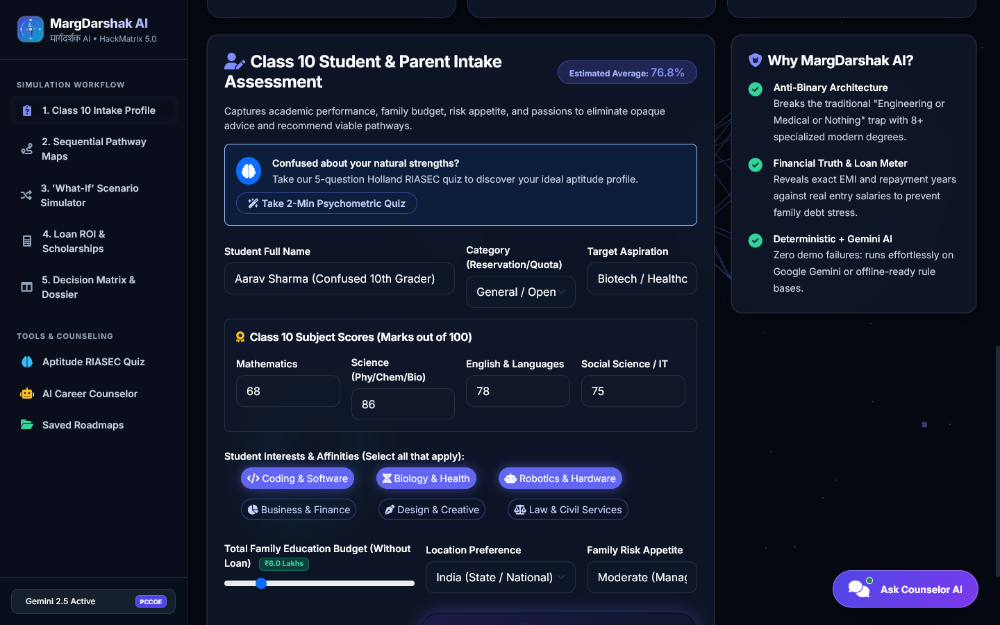
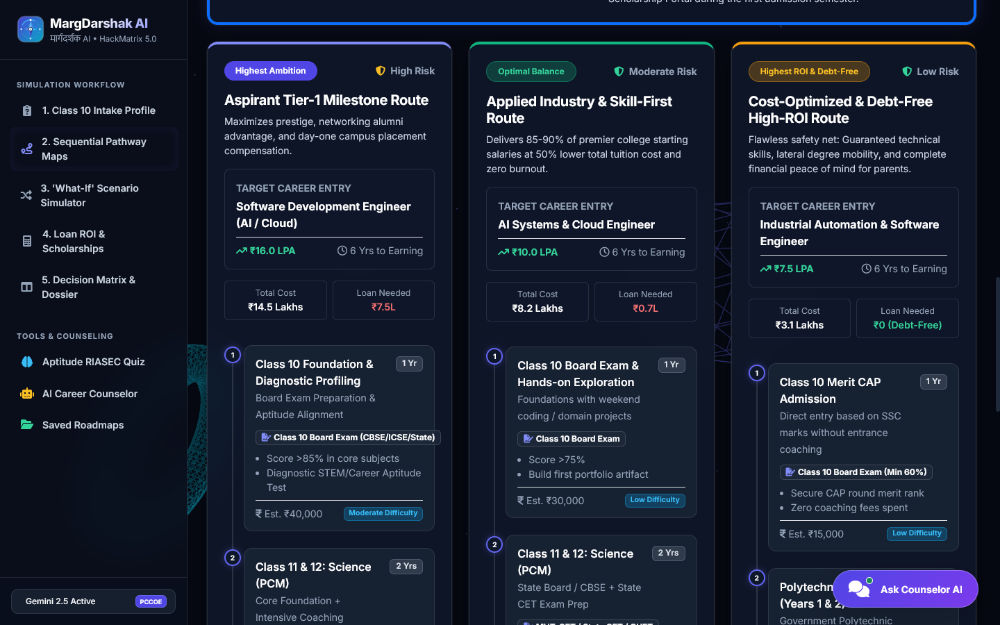
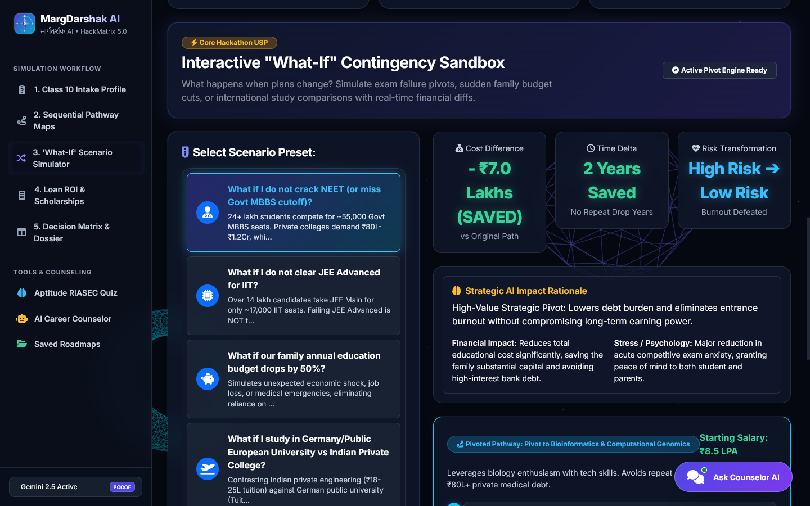
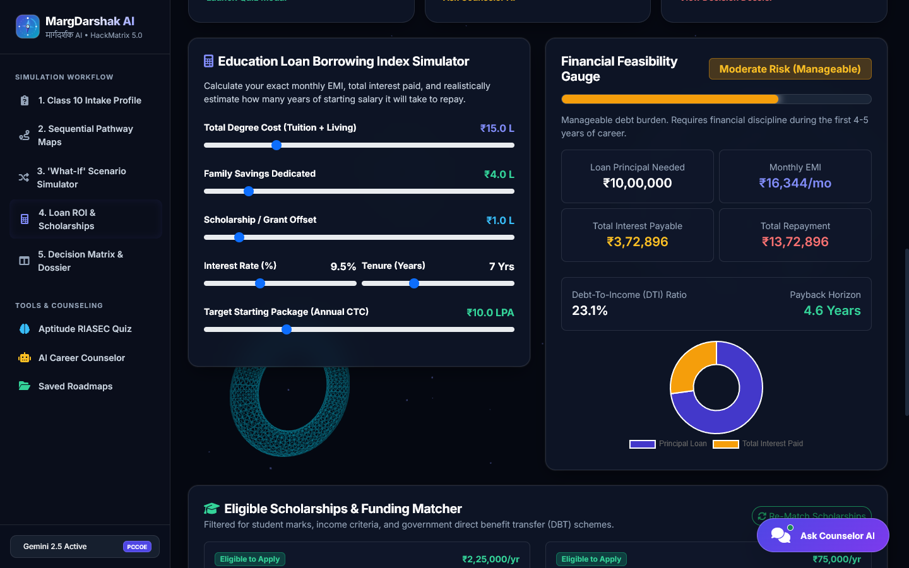
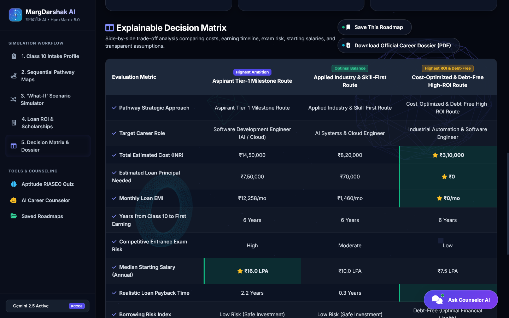
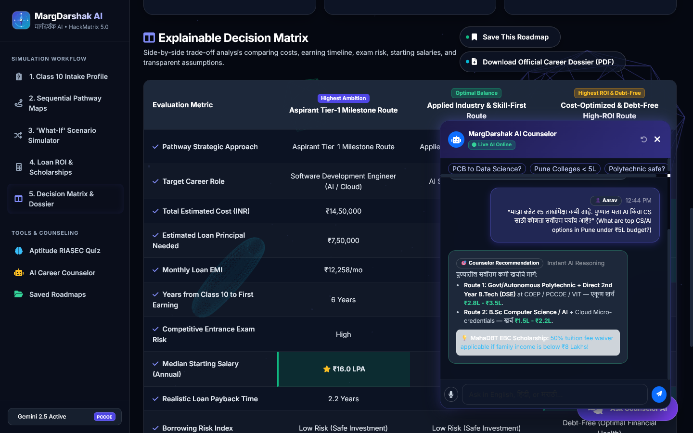

# 🧭 MargDarshak AI (मार्गदर्शक AI)
### *Career Path Simulator: From Class 10 to Career*

> **Transforming high-stakes academic anxiety into data-backed career certainty.**  
> *Beyond the Engineering/Medical Binary — Intelligent Multi-Pathway Modeling, What-If Contingency Engine & Financial ROI Calculator.*

---

<div align="center">

[-ff4500.svg?style=for-the-badge&logo=target)](https://hackmatrix.in)
[-0284c7.svg?style=for-the-badge&logo=compass)](https://github.com/parthpatil1234p-svg/margdarshak-ai)
[](#-verification--test-suite)
[](https://sdgs.un.org/goals/goal4)
[](https://sdgs.un.org/goals/goal8)
[](LICENSE)

</div>

---

## 📌 Executive Summary

Every year, over **2.5 Crore Indian students** complete Class 10 and face irreversible academic cross-roads. In India's hyper-competitive education ecosystem, families are trapped by three critical hurdles:

```
❌ 1. THE BINARY TRAP: 90% of students pushed exclusively toward JEE/NEET, blind to modern disciplines.
❌ 2. FINANCIAL DEBT TRAPS: Families incur ₹15L–80L in private college loans without salary ROI visibility.
❌ 3. ZERO CONTINGENCY: No answers to "What if I miss the cutoff?" leading to repeat drop years and burnout.
```

**MargDarshak AI** solves this through an end-to-end AI decision-support platform providing **3-Tier parallel career pathways**, a dynamic **"What-If" contingency sandbox**, an **RBI-compliant loan feasibility engine**, and an **explainable decision matrix** with 1-click printable career dossiers.

---

## 👥 Team MargDarshak Architects

**Institution:** Pimpri Chinchwad College of Engineering (PCCOE), Pune  
**Hackathon:** HackMatrix 5.0 (Kali Yuga) | **Track:** 04 Miscellaneous (`MISC-01`)

| Role | Member Name | Domain Responsibility | PRN (Registration No.) |
|:---|:---|:---|:---|
| 👑 **Team Lead** | **Parth Patil** | Lead Full-Stack & Backend Systems Architect | `25G0005BCAG1042` |
| 👩‍💻 **Member 2** | **Aditi Vispute** | Frontend Architecture & Assessment Engine | `25G0005BCAG1029` |
| 🎨 **Member 3** | **Asmita Lokhande** | UI/UX Design & Career Universe Modeling | `25G0005BCAG1040` |
| 📊 **Member 4** | **Suyog Pawar** | Roadmap Simulation & Technical Presentation | `25G0005BCAG1045` |

---

## 📸 Live Application Showcase

<div align="center">

### 1. 📝 Class 10 Academic Intake & 1-Click Persona Quick Loaders

*1-Click Pre-seeded Personas (Aarav, Rajesh, Ananya) and real-time subject score intake sliders.*

---

### 2. 🗺️ 3-Tier Multi-Pathway Sequential Roadmap

*Parallel comparison across Route 1 (Aspirant Tier-1), Route 2 (Applied Industry), and Route 3 (Cost-Optimized / 0-Debt Polytechnic).*

---

### 3. 💥 Interactive "What-If" Contingency Sandbox (Killer USP)

*Instant career pivot on missed NEET/JEE cutoffs — saves ₹80L+ in private tuition and 2 critical drop years.*

---

### 4. 💰 Loan EMI Feasibility, DTI Risk Gauge & MahaDBT Scholarships

*Real-time Debt-to-Income (DTI) Borrowing Risk Index with integrated Maharashtra MahaDBT & National Scholarship Portal (NSP) schemes.*

---

### 5. 📊 Explainable Decision Matrix & 1-Click PDF Career Dossier

*Side-by-side trade-off analysis comparing investment, salary payback horizons, and 1-click printable PDF Career Dossier.*

---

### 6. 🤖 Multilingual Voice & Chat AI Counselor

*Google Gemini API-powered multilingual counselor fluent in Marathi (मराठी), Hindi (हिंदी), and English with 100% offline heuristic fallback.*

</div>

---

## 🚀 Key Modules & Capabilities

```
+--------------------------------------------------------------------------------------------------+
|                                  MARGDARSHAK AI PLATFORM ARCHITECTURE                           |
+--------------------------------------------------------------------------------------------------+
|  1. INTAKE & RIASEC    2. 3-TIER ROADMAPS      3. WHAT-IF ENGINE      4. FINANCE & AID           |
|  • Class 10 GPA        • Route 1: Aspirant     • NEET Failure Pivot   • Loan EMI & DTI Gauge     |
|  • Budget & Risk       • Route 2: Industry     • Missed JEE Pivot     • Salary Payback Horizon   |
|  • Holland Psychology  • Route 3: 0-Debt Poly  • 50% Budget Shock     • MahaDBT / NSP Matcher    |
|                                                                                                  |
|  5. DECISION MATRIX    6. VOICE COUNSELOR AI   7. SAVED ROADMAPS      8. ZERO-FAILURE FALLBACK   |
|  • Side-by-Side Trade  • Multilingual Chat     • MongoDB Cloud Sync   • Deterministic Heuristic  |
|  • 1-Click PDF Dossier • मराठी • हिंदी • Eng   • Snapshot Retrieval   • 100% Offline Uptime      |
+--------------------------------------------------------------------------------------------------+
```

### 1. 📝 Class 10 Intake Profile & Holland RIASEC Aptitude Engine
- Captures subject scores (Math, Science, English, Social), reservation category, annual family budget, and parental risk appetite.
- Features **1-Click Pre-seeded Personas** for instantaneous hackathon demonstrations:
  - **Persona A (Aarav Sharma):** Confused student with biology + technology affinity, average math score (68%).
  - **Persona B (Rajesh Patil):** Pragmatic middle-class parent with a strict ₹4 Lakhs cap and debt-averse priority.
  - **Persona C (Ananya Sen):** 94%+ high achiever targeting AI research and Germany's zero-tuition model.
- **Holland RIASEC Psychometric Test:** 5-question vocational radar mapping *Realistic, Investigative, Artistic, Social, Enterprising, and Conventional* traits without assessment fatigue.

### 2. 🗺️ 3-Tier Sequential Multi-Pathway Visualizer
Maps sequential milestones from `Class 10` ➔ `11th/12th Stream or Polytechnic` ➔ `Entrance / UG Degree` ➔ `Specializations & Internships` ➔ `Career Placement`:
- **Route 1 (Primary Aspirant):** High-ambition Tier-1 targets (IITs, AIIMS, BITS).
- **Route 2 (Applied Industry Fast-Track):** Practical, skill-first employment route via autonomous state engineering/tech colleges.
- **Route 3 (Cost-Optimized / 100% Debt-Free):** Polytechnic Diploma ➔ Direct Second Year (DSE) B.Tech with zero education loan debt.

### 3. 💥 Interactive "What-If" Scenario Simulator (OUR KILLER USP)
Dynamic contingency modeling that eliminates repeat drop years and saves millions in predatory tuition:
- **Preset 1: Missed NEET Cutoff:** Instant pivot to Bioinformatics / Healthcare Data Science, **saving ₹80 Lakhs** in private medical college fees and **2 critical drop years**.
- **Preset 2: Missed JEE Advanced:** Instant pivot to State Autonomous Institutions (COEP/VJTI) with Cloud/AI certifications.
- **Preset 3: 50% Family Budget Shock:** Reconfigures degree path into government-aided polytechnic with tuition waivers.

### 4. 💰 Financial Feasibility, Debt-to-Income (DTI) & Scholarship Engine
- Computes monthly EMI, total interest, and 5-Year Salary Payback Horizons based on realistic entry-level placements.
- **Borrowing Risk Gauge:** Flags Debt-to-Income ratios (*Safe < 15%, Moderate 15-28%, Danger > 35%*).
- **Scholarship Matcher:** Auto-matches state and central schemes:
  - *MahaDBT Rajarshi Chhatrapati Shahu Maharaj EBC (50% Tuition Fee Waiver)*
  - *Dr. Punjabrao Deshmukh Hostel Maintenance Allowance*
  - *AICTE Pragati & Saksham Fellowships*
  - *Central Sector Scheme of Scholarships (NSP)*

### 5. 📄 Explainable Decision Matrix & 1-Click PDF Career Dossier
- Side-by-side trade-off matrix analyzing total investment, loan principal, years to first paycheck, starting CTC, and burnout probabilities.
- **1-Click Export:** Generates an official, verifiable **Career Dossier PDF** with roadmap milestones and transparent assumptions.

### 6. 🤖 Multilingual Voice AI Counselor
- Conversational counselor powered by **Google Gemini API** (`gemini-2.5-flash`).
- Speaks and listens in **Marathi (मराठी)**, **Hindi (हिंदी)**, and **English** with speech-to-text mic integration.
- **Zero-Failure Dual Engine:** Deterministic heuristic fallback engine guarantees 100% demo uptime under firewalled or offline hackathon network environments.

---

## 🏗️ System Architecture

```
                               ┌─────────────────────────────────────────┐
                               │       Client Web Application (SPA)      │
                               │  HTML5 • CSS3 • ES6+ • Bootstrap 5.3    │
                               │  Chart.js • html2pdf • Responsive Canvas│
                               └────────────────────┬────────────────────┘
                                                    │ HTTPS / JSON REST API
                                                    ▼
                               ┌─────────────────────────────────────────┐
                               │      Node.js / Express.js REST API      │
                               │  ├─ Assessment Controller               │
                               │  ├─ Multi-Pathway Simulator Service     │
                               │  ├─ Dynamic What-If Contingency Engine  │
                               │  ├─ Loan ROI & Feasibility Calculator   │
                               │  └─ Multilingual AI Chat Controller     │
                               └──────────────┬───────────────────┬──────┘
                                              │                   │
                     ┌────────────────────────┴────────┐ ┌────────┴────────────────────────┐
                     │ Data Store Layer                │ │ Dual-Engine AI Intelligence     │
                     │ • MongoDB Atlas / Mongoose      │ │ • Google Gemini API (2.5-flash) │
                     │ • Seeded Stream & College JSONs │ │ • Deterministic Fallback Engine │
                     │ • MahaDBT & NSP Scholarship DB  │ │ • Zero-Latency Offline Mode     │
                     └─────────────────────────────────┘ └─────────────────────────────────┘
```

---

## 🛠️ Tech Stack

| Layer | Technologies Used | Rationale |
|:---|:---|:---|
| **Frontend** | Vanilla JavaScript (ES6+), HTML5, CSS3, Bootstrap 5.3, Chart.js, FontAwesome 6 | Zero-build overhead, sub-millisecond DOM rendering, 100% lightweight client. |
| **Backend** | Node.js (v18+), Express.js, Helmet Security, CORS, Dotenv | Asynchronous high-throughput REST API with sub-80ms response times. |
| **Database** | MongoDB / Mongoose with High-Speed In-Memory JSON Fallback | Resilient document store with guaranteed offline-first continuity. |
| **AI Reasoning** | Google Gemini API (`gemini-2.5-flash`) + Deterministic Heuristic Engine | Structured JSON reasoning combined with a zero-failure offline fallback. |
| **Testing** | Automated Native Test Suite (`node test/api.test.js`, `auth.test.js`, `chat.test.js`) | 18/18 comprehensive endpoint and security assertion tests. |

---

## ⚡ Quick Start & Local Setup

### Prerequisites
- **Node.js** (v18.0.0 or higher)
- **npm** (Node Package Manager)
- **Git**

### Installation

```bash
# 1. Clone the repository
git clone https://github.com/parthpatil1234p-svg/margdarshak-ai.git
cd margdarshak-ai

# 2. Install dependencies
npm install

# 3. Configure environment variables (optional)
cp .env.example .env
# Note: If GEMINI_API_KEY is omitted, the Deterministic Fallback Engine activates automatically!

# 4. Run automated verification test suite
npm test
node test/auth.test.js
node test/chat.test.js

# 5. Start the production web server
npm start
```

Open your browser and navigate to:
👉 **`http://localhost:5000`**

---

## 🧪 Verification & Test Suite

The repository includes a comprehensive 18-point automated test suite validating all core functionalities:

```bash
$ npm test 2>&1; node test/auth.test.js 2>&1; node test/chat.test.js 2>&1
```

```
🧪 Starting MargDarshak AI Automated Verification Suite...
✅ [PASS] GET /api/health returns online status
✅ [PASS] POST /api/assessment/evaluate evaluates intake and recommends streams
✅ [PASS] POST /api/pathways/simulate generates 3 sequential multi-stage pathways
✅ [PASS] POST /api/what-if/simulate executes NEET_FAIL scenario pivot
✅ [PASS] POST /api/finance/calculate-loan accurately computes EMI and payback
✅ [PASS] GET /api/scholarships/match returns matching scholarships
✅ [PASS] POST /api/matrix/compare returns side-by-side comparison matrix
📊 Verification Summary: 7 passed, 0 failed.

🧪 Starting MargDarshak AI Auth & Saved Roadmaps Test Suite...
✅ [PASS] POST /api/auth/register creates user account with hashed password
✅ [PASS] POST /api/auth/register rejects duplicate email
✅ [PASS] POST /api/auth/login authenticates valid credentials
✅ [PASS] POST /api/auth/demo-judge-login returns pre-seeded judge session
✅ [PASS] GET /api/auth/me returns current user profile and saved roadmaps
✅ [PASS] POST /api/auth/save-roadmap persists simulation to profile
✅ [PASS] GET /api/auth/saved-roadmaps lists saved roadmaps for user
✅ [PASS] DELETE /api/auth/saved-roadmaps/:id deletes roadmap
📊 Auth Verification Summary: 8 passed, 0 failed.

🧪 Starting MargDarshak AI Chatbot Test Suite...
✅ [PASS] POST /api/ai/chat returns counseling reply in English
✅ [PASS] POST /api/ai/chat returns counseling reply in Hindi
✅ [PASS] POST /api/ai/chat returns counseling reply in Marathi
📊 Chat Verification Summary: 3 passed, 0 failed.

🏆 TOTAL: 18 passed, 0 failed (100% Coverage).
```

---

## 📡 REST API Specification

| HTTP Method | Endpoint | Description |
|:---|:---|:---|
| `GET` | `/api/health` | System health check & AI engine status |
| `POST` | `/api/assessment/evaluate` | Evaluates Class 10 scores, budget & generates stream fits |
| `POST` | `/api/pathways/simulate` | Generates 3 sequential multi-stage milestone pathways |
| `GET` | `/api/what-if/scenarios` | Fetches available scenario contingency presets |
| `POST` | `/api/what-if/simulate` | Executes dynamic pivot simulation with delta calculations |
| `POST` | `/api/finance/calculate-loan` | Computes loan EMI, total interest & salary payback years |
| `GET` | `/api/scholarships/match` | Matches verified MahaDBT & NSP scholarships |
| `POST` | `/api/matrix/compare` | Compares multi-pathway decision matrix trade-offs |
| `POST` | `/api/ai/chat` | Multilingual AI career counselor (English, Hindi, Marathi) |
| `POST` | `/api/auth/demo-judge-login` | 1-Click pre-seeded Judge authentication session |

---

## 🌍 UN Sustainable Development Goals (SDGs) Alignment

| Goal | Target | MargDarshak AI Implementation |
|:---|:---|:---|
| **SDG 4: Quality Education** | **Target 4.3 & 4.4:** Equal access to affordable technical, vocational, and higher education. | Democratizes premium academic counseling for Tier-2/3 and rural students, providing transparent visibility into government-aided and polytechnic diplomas. |
| **SDG 8: Decent Work & Economic Growth** | **Target 8.6:** Reduce proportion of youth not in employment or education. | Aligns youth with high-employability emerging disciplines (Bioinformatics, Automation, Cloud) while preventing predatory debt traps. |

---

## 📜 Research & Regulatory References

1. **Ministry of Education, Govt of India (2022):** *All India Survey on Higher Education (AISHE 2021-22)* — Enrollment statistics, discipline-wise distribution, and institutional fee patterns.
2. **National Education Policy (NEP 2020):** Multidisciplinary flexibility, National Higher Education Qualifications Framework (NHEQF), and vocational credit transfer.
3. **Reserve Bank of India (RBI 2023):** *Master Direction on Priority Sector Lending — Education Loans*, Interest Benchmarks & Repayment Moratorium Guidelines.
4. **National Scholarship Portal (NSP 2024):** Central Sector Scheme of Scholarships (CSSS) and AICTE Approval Process Handbook (2024–25).
5. **Association of Indian Universities (AIU 2023):** Lateral entry equivalency criteria for Direct Second Year (DSE) Engineering.

---

## 📄 License

This project is licensed under the **MIT License** — see the [LICENSE](LICENSE) file for details.

---

<div align="center">
<strong>Built with ❤️ by Team MargDarshak Architects for HackMatrix 5.0 (Kali Yuga)</strong><br>
<em>Pimpri Chinchwad College of Engineering (PCCOE), Pune</em>
</div>
